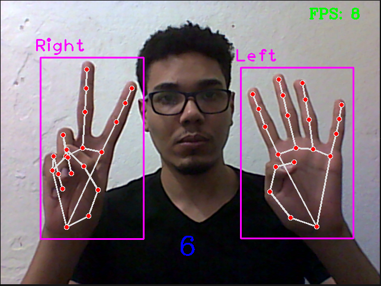

# math-gestures
This is the final project of **Digital Image Processing** of the **Universidade Federal do Rio Grande do Norte (UFRN)**.

## subject
The basic idea of this project is perform the add operation using only gestures with yout hands.

## Usage
To use the software all you have to do is clone this repo and execute the script using python. You'll need a webcan attached to yout computer (this script consider the desfault computer webcan). Once the script is running you have to put your 2 hand in front of webcan and perform some operation and the result will be displayed on the screen.

